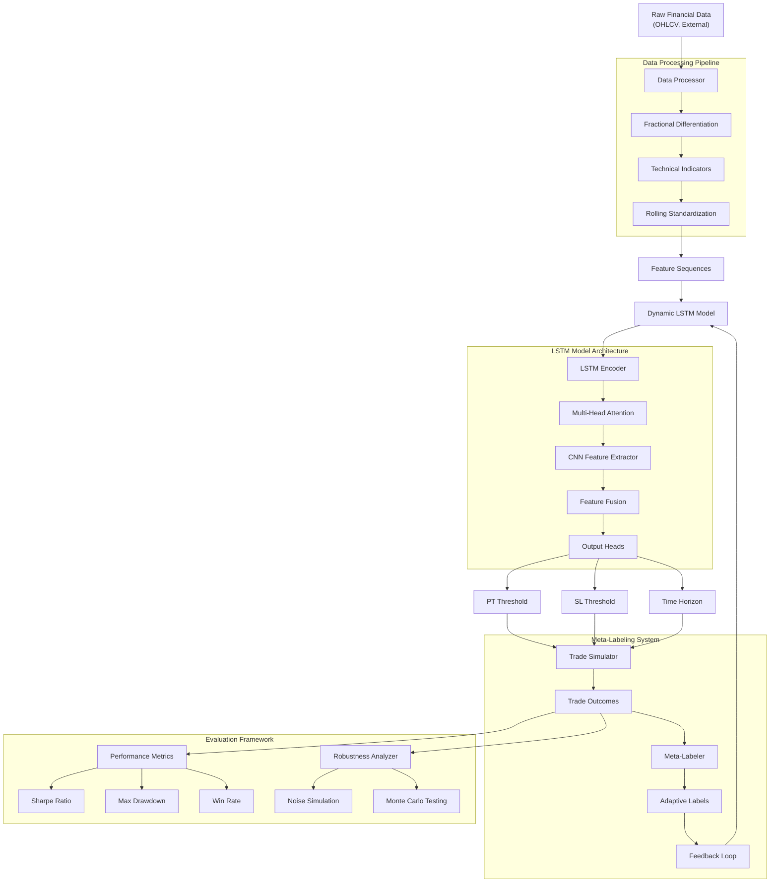

# Dynamic Data Labeling System Architecture

## System Components Overview

### 1. Data Processing Pipeline
- **Raw Data Ingestion**: OHLCV data from yfinance, external market data (VIX)
- **Fractional Differentiation**: Maintains memory while achieving stationarity
- **Technical Indicators**: 20+ indicators including RSI, MACD, ADX, Bollinger Bands
- **Feature Engineering**: Rolling standardization without look-ahead bias

### 2. Dynamic LSTM Model Architecture
- **Input Layer**: Positional encoding for temporal sequences
- **LSTM Encoder**: Bidirectional LSTM layers with dropout
- **Attention Mechanism**: Multi-head attention for important feature focus
- **CNN Component**: Spatial pattern extraction from feature sequences
- **Feature Fusion**: Combines LSTM and CNN outputs
- **Output Heads**: Three separate heads for PT, SL, and TH prediction

### 3. Meta-Labeling System
- **Trade Simulation**: Realistic trade execution based on predicted parameters
- **Outcome Classification**: Categorizes trades as profit target hit, stop loss hit, etc.
- **Label Generation**: Creates binary, continuous, and multi-class labels
- **Adaptive Feedback**: Adjusts labeling strategy based on performance
- **Continuous Learning**: Model retraining with updated labels

### 4. Evaluation Framework
- **Financial Metrics**: Comprehensive performance measurement
- **Risk Assessment**: Drawdown, volatility, Value at Risk calculations
- **Robustness Testing**: Noise simulation and Monte Carlo analysis
- **Visualization**: Interactive charts and performance dashboards
- **Comparative Analysis**: Benchmarking against traditional methods

## Data Flow

1. **Input**: Raw financial time series data (OHLCV + external features)
2. **Processing**: Fractional differentiation → Technical indicators → Standardization
3. **Modeling**: LSTM-CNN hybrid with attention → Dynamic parameter prediction
4. **Simulation**: Trade execution with predicted PT, SL, TH parameters
5. **Evaluation**: Performance metrics + Robustness testing
6. **Adaptation**: Feedback loop for continuous model improvement

## Key Innovation Points

- **Dynamic Parameter Prediction**: Unlike fixed thresholds, parameters adapt to market conditions
- **Memory Preservation**: Fractional differentiation maintains predictive power
- **Meta-Labeling**: Separates trade direction from risk management decisions
- **Attention-Enhanced LSTM**: Focuses on relevant temporal patterns
- **Robust Evaluation**: Comprehensive testing under various noise conditions
- **Adaptive Learning**: Continuous improvement through trade outcome feedback
